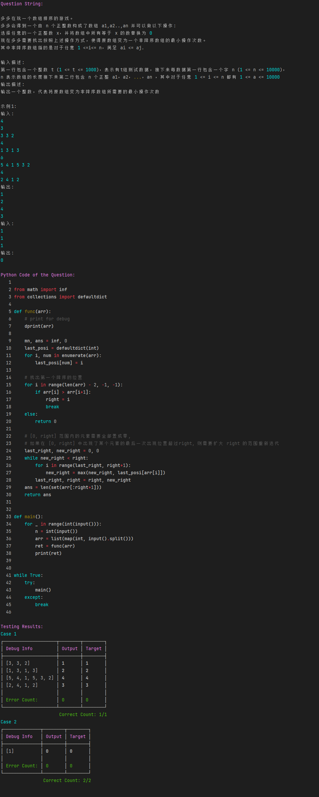

# In Local Python IDE, Run Algorithm Problem whose in/out format is ACM format.

**This is a package help you to run in local python IDE.**


## Installation

- pip install
    ```shell
    pip install git+https://github.com/hhqx/acm_tools.git
    # or
    git clone git@github.com:hhqx/acm_tools.git    
    cd acm_tools
    python setup.py install
    ```
- Test for install
    ```shell
    python -m acm_tools
    ```
    Results after correct installation:
    

## Recent Changes
- 2023年4月1日23:29:27, add validator.
- 2023年3月31日22:33:26, initial commit.
  

## Edit local template

### Template of Python

```python3
from acm_tools import dprint, load_test_str, print, input

# 注意输入输出示例必须以"Input:","Output"开头或者"输入:","输出"开头
question_str = """
Input:
%INPUT_STRING1%

Output:
%OUTPUT_STRING1%

Input:
%INPUT_STRING2%
Output:
%OUTPUT_STRING2%

...
"""
load_test_str(question_str)


#### START 代码从这里开始 ###

# WRITE YOUR CODE 

#### END 代码在这里结束 ###
```

### For Example
```python3
from acm_tools import dprint, load_test_str, input, print

question_str = """
多多在玩一个数组排序的游戏。
多多会得到一个由 n 个正整数构成了数组 a1,a2..,an 并可以做以下操作:
选择任意的一个正整数 x，并将数组中所有等于 x 的数替换为 0
现在多多需要找出按照上述操作方式，使得原数组变为一个非降序数组的最小操作次数。
其中非降序数组指的是对于任意 1 <=i<= n，满足 ai <= aj.

输入描述:
第一行包含一个整数 t (1 <= t <= 1000)，表示有  组测试数据接下来每数据第一行包含一个字n(1 <= n <= 10000)，n 表示数组的长度接下未第二行包含 n 个正整 a1，@2，...，an ，其中对于任意 1 <= i <= n 都有 1 <= a <- 10000
输出描述:
输出一个整数，代表将原数组变为非降序数组所需要的最小操作次数

示例1:
输入:
4
3
3 3 2
4
1 3 1 3
6
5 4 1 5 3 2
4
2 4 1 2
输出:
1
2
4
3
输入:
1
1
1
输出:
0
"""
load_test_str(question_str)

#### START 代码从这里开始 ###

from math import inf
from collections import defaultdict

def func(arr):
    # print to debug info, before your submit, you should comment it of def it as empty function: "def dprint(): pass"
    dprint(arr)

    mn, ans = inf, 0
    last_posi = defaultdict(int)
    for i, num in enumerate(arr):
        last_posi[num] = i

    # 找出第一个降序的位置
    for i in range(len(arr) - 2, -1, -1):
        if arr[i] > arr[i+1]:
            right = i
            break
    else:
        return 0

    # [0, right] 范围内的元素需要全部置成零,
    # 如果在 [0, right] 中出现了某个元素的最后一次出现位置超过right, 则需要扩大 right 的范围重新迭代
    last_right, new_right = 0, 0
    while new_right < right:
        for i in range(last_right, right+1):
            new_right = max(new_right, last_posi[arr[i]])
        last_right, right = right, new_right
    ans = len(set(arr[:right+1]))
    return ans


def main():
    for _ in range(int(input())):
        n = int(input())
        arr = list(map(int, input().split()))
        ret = func(arr)
        print(ret)


while True:
    try:
        main()
    except:
        break

#### END 代码在这里结束 ###

```

  


